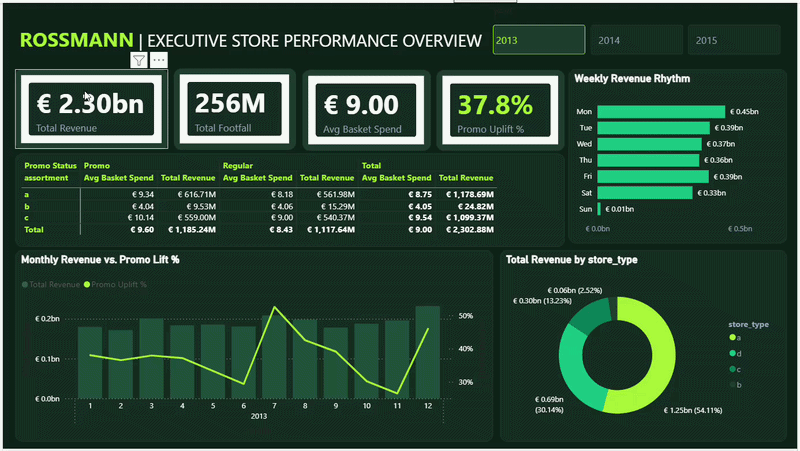

# Rossmann Retail Intelligence: Sales Forecasting & BI Pipeline
Using 1M+ daily records from 1,115 Rossmann stores, this project ingested transactional data into a serverless PostgreSQL database, built Python machine learning models to forecast sales, and engineered an executive Power BI dashboard to quantify promotional uplift (+37.5%), footfall dynamics, and assortment profitability for data-driven decisions.


## Why This Project?

Retail store networks operate on narrow margins where mismatched inventory, inaccurate staffing schedules, and misdirected promotional budgets translate into millions of euros in lost revenue. 

Typical enterprise challenges addressed in this project:
* **The Promotion Dilemma**: Quantifying whether promotional price cuts generate true incremental margin or simply cannibalize full-price baseline spend.
* **Operational Friction**: Managing weekly demand swings—such as the operational surge following statutory Sunday closures.
* **The Analytics Disconnect**: Data science predictive models often remain trapped in isolated Jupyter notebooks, disconnected from store operations. This project bridges raw transactional data directly to an executive decision cockpit.


## Dataset Overview

[Rossmann](https://www.kaggle.com/competitions/rossmann-store-sales/data) — one of Europe’s largest drugstore chains store Sales, sourced from Kaggle. Historical Dataset (spanning January 1, 2013 to July 31, 2015) contains 1M+ daily sales records across 1,115 Rossmann stores locations across Germany.

## Core Tech Stack

| Layer | Technology |
| :--- | :--- |
| **Cloud Database** | **Neon Serverless PostgreSQL** |
| **DB Management** | **pgAdmin 4** | 
| **ETL & Data Pipeline** | **Python (SQLAlchemy, psycopg2-binary, pandas)** | 
| **Predictive Modeling** | **scikit-learn, numpy** | 
| **Business Intelligence** | **Power BI Desktop** | 
| **Environment** | **Python 3.10+, Google Colab** |


## Power BI Dashboard

<p align="center">
  
</p>


### Executive Architecture
1. **KPI Banner**: Instant metrics tracking **Total Revenue (€1.39bn)**, **Total Footfall (148M)**, **Average Basket Spend (€9.42)**, and **Promo Uplift % (37.5%)**.
2. **Year Slicer**: Buttons (`2013`, `2014`, `2015`) allowing instant global state recalculation.
3. **Weekly Revenue Rhythm**: Displaying consumer demand patterns chronologically from Monday through Sunday.
4. **Assortment & Promo Uplift Matrix**: Direct comparative table evaluating customer basket spend and overall revenue across product assortments (`Basic`, `Extra`, `Extended`) during `Promo` vs. `Regular` days.
5. **Monthly Revenue vs. Promo Lift %**: Dual-axis combination chart mapping gross monthly revenue parallely with campaign efficiency trends.
6. **Store Type Contribution**: Donut chart showing revenue splits across store formats (`a`, `b`, `c`, `d`).


## End-to-End Methodology
```
1.0M+ Historical Records (1,115 Stores)
               │
               ▼
┌───────────────────────────────┐
│ 1. ETL & Cloud Ingestion      │ ──► Parse dates, filter closures (Open=0)
│    (Python / SQLAlchemy)      │ ──► Impute median CompetitionDistance
└──────────────┬────────────────┘
               │
               ▼
┌───────────────────────────────┐
│ 2. Relational Star-Schema     │ ──► PostgreSQL hosted on Neon Cloud
│    (PostgreSQL)               │ ──► dim_store, dim_date, fct_daily_sales
└──────────────┬────────────────┘
               │
        ┌──────┴──────────┐
        ▼                 ▼
┌──────────────┐    ┌───────────────┐
│ 3A. Feature  │    │ 3B. Semantic  │
│ Engineering  │    │ DAX Modeling  │
│ • 7D/14D lag │    │ • Basket Spend│
│ • Roll means │    │ • Promo Lift  │
│ • Hol. flags │    │ • Day sort    │ 
└──────┬───────┘    └──────┬────────┘
       │                   │
       ▼                   ▼
┌──────────────┐    ┌──────────────┐
│ 4A. Random   │    │ 4B. Power BI │
│ Forest Model │    │ Dashboard    │
│              │    │ • Year pills │
│ • RMSPE eval │    │ • 4-quadrant │
│              │    │ • Cross-filter
└──────┬───────┘    └──────┬───────┘
       │                   │
       └───────┬───────────┘
               │
               ▼
┌───────────────────────────────┐
│ 5. Operational Strategy       │ ──► Capitalize on Monday surge (€0.45bn)
│    & Revenue Optimization     │ ──► Prioritize Store Type 'a' (53% share)
└───────────────────────────────┘
```
## Method
**1. Exploratory Data Analysis (EDA):** Analyzed 1.07 M+ rows across all 1,115 stores; flagged that `Sales == 0` occurred almost exclusively when `Open == 0` (especially mandatory Sunday closures), and confirmed the target variable Sales was strongly right-skewed.

**2. Leakage & Bias Flags:** Flagged Customers as target leakage and excluded it from feature sets because customer counts are unknown before a trading day begins.

**3. Key Data Discoveries:** Found that stores with close competitors (`CompetitionDistance < 1,000 m`) actually posted higher baseline sales due to prime high-footfall locations; active campaigns (`Promo == 1`) drove a clear `+37.5% volume uplift`.

**4. Feature Engineering & Selection:** Imputed missing `CompetitionDistance` values using median values grouped by `StoreType (a, b, c, d)`; built 7-day and 14-day sales lags, rolling averages, and extracted date features (`DayOfWeek`, `Month`, `WeekOfYear`, `IsWeekend`) while dropping redundant `Promo2_interval` columns.

**5. Model Training:** Trained a Random Forest Regressor in Python on open store days (`Open == 1` and `Sales > 0`), capturing non-linear relationships across promotional cycles, calendar features, and store formats.

**6. Model Evaluation & Outcomes:** Validated using RMSPE (Root Mean Squared Percentage Error) and RMSE over a strict out-of-time chronological split, delivering stable forward-week sales predictions across both rural branches and top-tier Type `a` flagships.

## Key Findings
**1. Model Performance & Validation:** Tested on an out-of-time chronological holdout of `41,396` records across the final 6 weeks (June 19 – July 31, 2015), the Random Forest regressor achieved a RMSPE of `16.49%`.

**2. Day-to-Day Accuracy:** The model's Median Absolute Percentage Error is `9.06%`. Typical daily branch predictions stay within ~9% of actual turnover, while the higher RMSPE is driven by squaring errors on occasional volatile outlier days.

**3.** High-turnover flagship locations are predicted with tight relative accuracy. For example, on `Store 1114` with `€21,834` in actual daily turnover, the model predicted `€22,144.34` (an absolute error of only `+€310.34`, or `1.42%`).

**4. Zero-Leakage Generalization:** Real-time footfall (Customers) was excluded from the feature matrix because future customer counts are unknown prior to store opening. The 16.49% error represents genuine out-of-sample predictive power without target leakage.

**5. Feature Importance:** The tree-split analysis confirms that three core factors drive roughly 70% of all sales variance:
**a.** `competition_distance` (28.28% Importance): Stores located in denser commercial centers with closer competitors maintain fundamentally distinct baseline turnover dynamics compared to isolated rural stores.
**b.** `store Identifier` (22.14% Importance): The individual store ID accounts for over a fifth of the model's predictive weight, capturing persistent store-level baseline volume, location idiosyncrasies, and established customer habits.
**c.** `promo Active Flag` (19.39% Importance): Promotional status is the third largest split driver, confirming that active discount/marketing campaigns create immediate, structural demand shifts that override general calendar baselines.

## Pipeline & Operational Takeaways
**1.** Training on log(1+Sales) rather than raw sales effectively stabilized variance across divergent store volumes, enabling standard mean-squared-error objective functions to optimize percentage-based retail metrics directly.
**2.** The pipeline successfully mapped inference to all 41,088 test records in test.csv, explicitly enforcing structural zero sales on closed store days (Open == 0)
